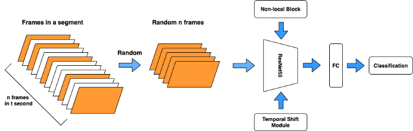

#### *Authors: Duc Cd*
# Basketball Highlight Generator #
In project, I will introduce a model can generate basketball highlight video given full match video by combining Temporal Shilf Module (TSM) and any machine learning techniques: Non-local, Neural network, ...

### What is this repository for? ###
**backbone**: Contains TSM module including related modules: shift mechanism, Non-local block, ...
**basketball_highlight.py**: File introduces how to load TSM pretrained modeled and builds classification

Due to the cheap expense, it is not easy to collect sufficiently training data. Current checkpoint reached F1~90% for classification task and performed 90 minutes input video in 30 minutes, it will be updated soon enclosing inference introduction
